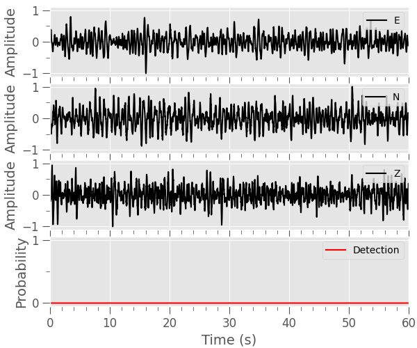
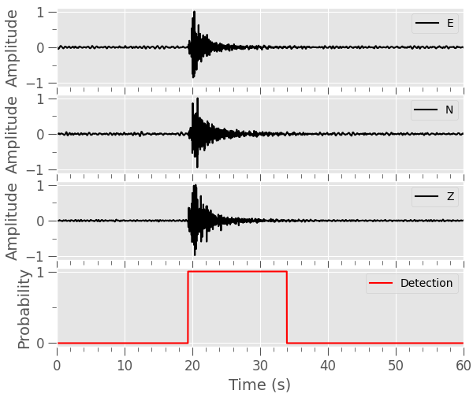
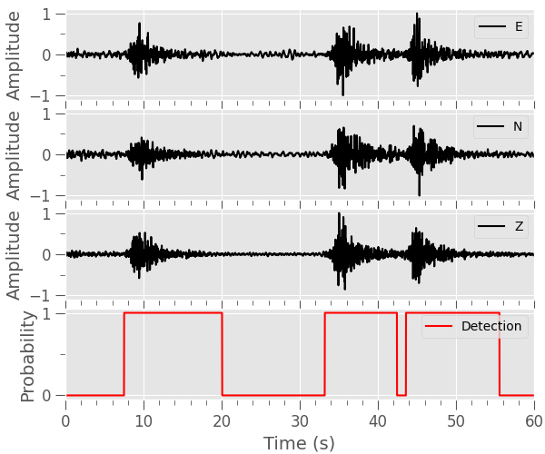
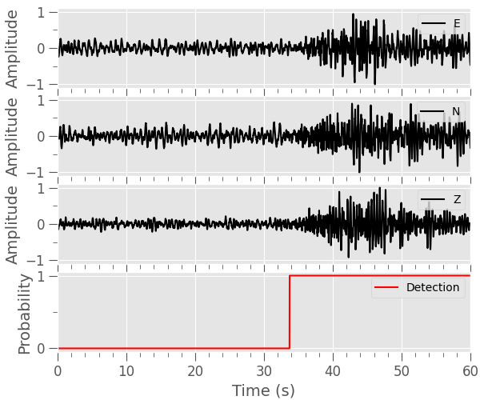
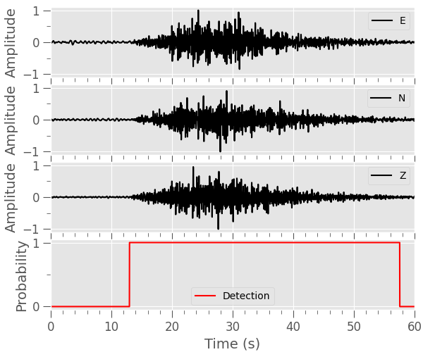
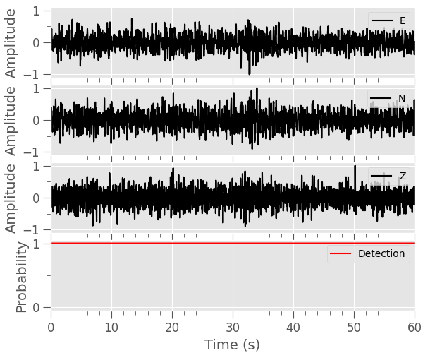

# Volcano-Seismic Event Dataset (VSED)
A Data Set of Volcano-seismic Signals for AI

### You can get the wavefoms from here: 

##### The zip file contains one hdf5 (data) and one CSV (metadata) files for ~7000 3C volcano-seismic waveforms.

https://rebrand.ly/VSEDdataset  (dataset ~500 MB) Noise and Volcano-seismic events

### Example of data selection and accessing (noise waveforms):

